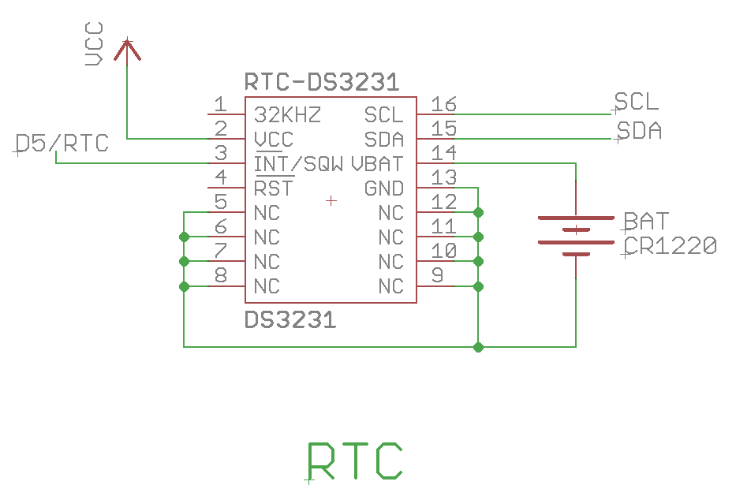
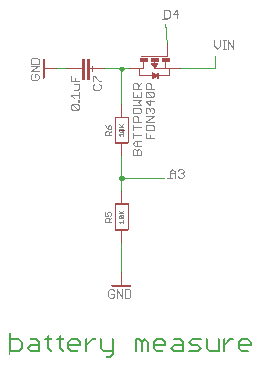
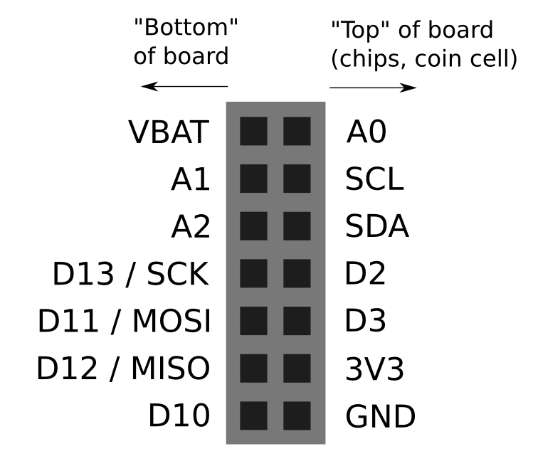
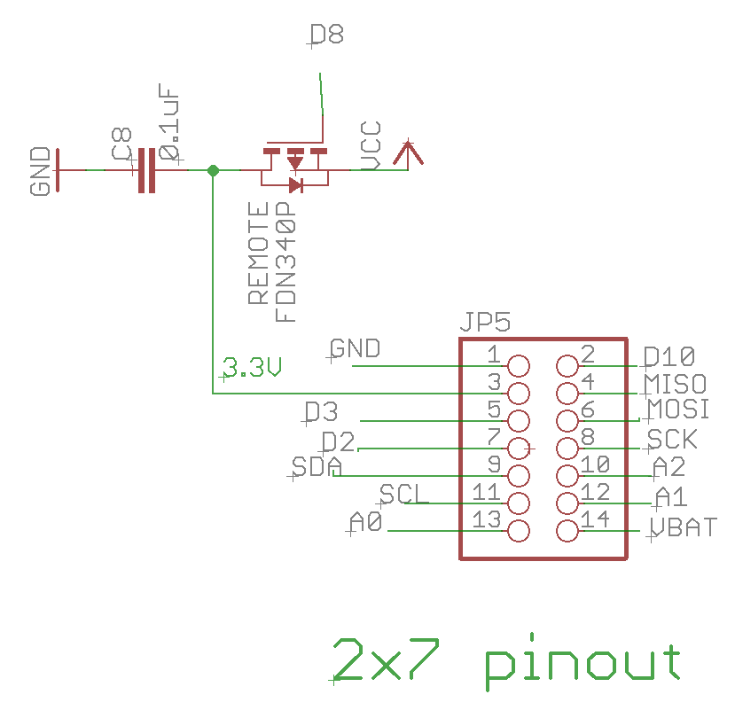
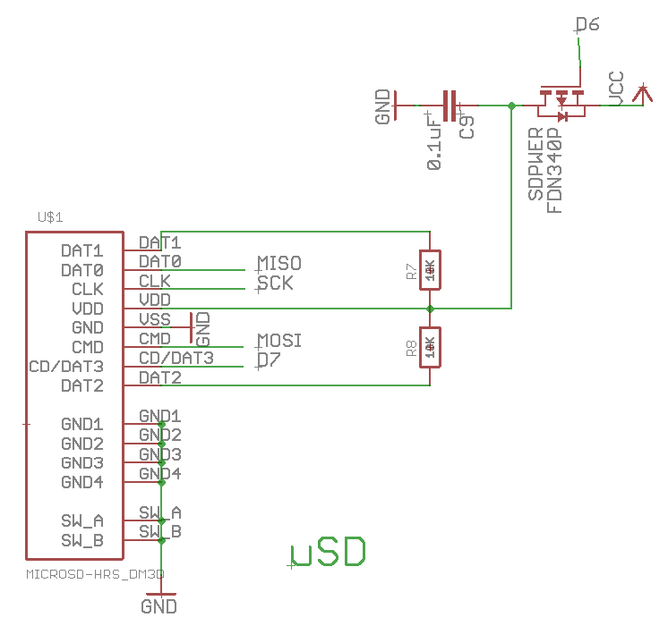

# Using the RTC / Low-Power Operation

When using the Riffle to log data for extended periods, there are several techniques to extending battery life.  

## Putting the 328 chip to Sleep

One of the most basic is to put the Atmel 328 chip into a "sleep" mode that consumes less power, during times that no active sensing is being done.  This is accomplished by the "LowPower" library by RocketScream. Thiis reduces the current of the board from tens of milliamps to a fraction of a milliamp -- which extends the battery from about 10 days of operation to several months, depending on the sleep/wake protocol implemented.

However, the 328 chip is not very good at keeping track of the time while in sleep mode, so it's important to use the Real Time Clock (RTC) to keep track of the time.

Additionally, the RTC has an 'alarm' functionality that, in combination with an 'interrupt' feature on the Atmel328, can wake the Riffle from sleep.  When the alarm is set, the RTC will pull an alarm pin to the high-voltage (HIGH) setting.  A special pin on the Riffle -- **D5** -- can be used as a hardware interrupt.  D5 can be programmed so that, even during sleep, it will 'listen' for this sudden change, and wake up the Riffle out of sleep mode.



**Code example**.  In "riffle_low_power_oparation.ino" code above, sleep functionality is implemented at the end of the Arduino IDE "loop" function by line 137:

```arduino
enterSleep(nextAlarm);
```

The function "enterSleep()" (lines 148 through 157) sets the proper wake interval and cuts off power to the microSD card (see "Switching Off the MicroSD card" below):

```arduino
// Turns off SD Card Power, Sets Wake Alarm and Interrupt, and Powers down the MCU
void enterSleep(DateTime& dt) { //argument is Wake Time as a DateTime object
  delay(50); //Wait for file writing to finish. 10ms works somethings, 50 is more stable
  digitalWrite(sd_pwr_enable, HIGH); //Turn off power to SD Card
  delay(100); //wait for SD Card to power down was 100ms
  rtc.clearAlarm(); //resets the alarm interrupt status on the rtc
  enableInterrupt(rtc_int, rtc_interrupt, FALLING); //enables the interrupt on Pin5
  rtc.enableAlarm(dt); //Sets the alarm on the rtc to the specified time (using the DateTime Object passed in)
  delay(1); //wait for a moment for everything to complete
  LowPower.powerDown(SLEEP_FOREVER, ADC_OFF, BOD_OFF); //power down everything until the alarm fires
}
```
Note that "enableInterrupt()" utilizes a variable we defined on line 19:

```arduino
const int rtc_int = 5; //rtc interrupt pin
```

## Switching off Battery Measurement Circuit

The Riffle 0.1.8 has an on-board circuit to measure the current battery level, via analog pin **A3**. This is done via a simple voltage divider circuit between the battery and ground;  one issue regarding power loss is that a voltage divider will slowly leak power to ground.  To avoid this, the Riffle 0.1.8 has placed a MOSFET switch on this circuit, so that the measurement circuit can be turned "off" when the battery isn't being measured.  This functionality is controlled by pin **D4**.  



**Code example**. In "riffle_low_power_oparation.ino", we first define a constant to refer to the battery control pin, on line 18:

```arduino
const int bat_v_enable = 4; //enable pin for bat. voltage read
```

Then in setup(), we set this pin into the proper OUTPUT mode, on lines 51-53:

```arduino
// turn off the battery monitor circuitry for now, to save power
  pinMode(bat_v_enable, OUTPUT);
  digitalWrite(bat_v_enable, HIGH); //Turn off Battery Reading
```

In the main loop, on lines 84 and 85, we use a function we define later, 'getBat_v()', to measure the battery voltage:

```arduino
// get the battery voltage  
  bat_v = getBat_v(bat_v_pin, bat_v_enable); //takes 20ms
```
This function turns the battery measurement circuit on, makes the measurement, and then turns it back off. on lines 159 - 169:

```arduino
//returns battery voltage 
float getBat_v(byte p, byte en) {
  float v;
  digitalWrite(en, LOW); //write mosfet low to enable read
  delay(10); //wait for it to settle
  v = analogRead(p); //read voltage
  delay(10); //wait some more...for some reason
  digitalWrite(en, HIGH); //disable read circuit
  v = (v * (3.3 / 1024.0)) * 2.0; //calculate actual voltage
  return v;
}
```

## Switching off External Sensors

One typical application of the Riffle is to connect it to external sensors via the 2x7 pin header on one end of the board.  Usually, any such sensors will be powered via the "3.3V" or "3V3" pin. 



Even if the main microcontroller chip is put to sleep, however, connected sensors can still use power when not being used.  In order to avoid this effect, the Riffle 0.1.8 has a MOSFET switch, controlled by pin **D8**, that can "turn off" the "3V3" line. 



**Code example**. In "riffle_low_power_oparation.ino", on line 21 we define a variable for pin **D8**, for convenience:

```arduino
const int hdr_pwr_enable = 8; //enable pin for header power
```
On lines 100 through 106, we show how power to the 2x7 would be turned on / powered off, if external sensors were used:

```arduino
 // turn on external sensors
  digitalWrite(hdr_pwr_enable, LOW); //Turn ON power external header

  // make measurement
  // measurement code would go here

  // turn off external sensors
  digitalWrite(hdr_pwr_enable, HIGH); //Turn OFF power external header
``` 

## Switching off the microSD card

The Riffle is typically used to log data to a microSD card.  MicroSD cards are complex devices in their own right, and while some sleep at low currents, others have quite variable power consumption.  The RIffle 0.1.8 can cut off power to the microSD card using a MOSFET switch controlled by pin **D6**.



**Code example**. In "riffle_low_power_oparation.ino", we first assign a variable name to the MOSFET pin **D6** on line 20:

```arduino
const int sd_pwr_enable = 6; //enable pin for SD power
```

Then, all of the action occurs in the "writeToSd()" function on lines 180 - 211:

```arduino
//Powers on SD Card, and records the give values into "data.csv"
//Notes: The delay times are important. The SD Card initializations
//     will fail if there isn't enough time between writing and sleeping
void writeToSd(long t, float v, float temp) {
  digitalWrite(led, HIGH); //LED ON, write cycle start
  /**** POWER ON SD CARD ****/
  digitalWrite(sd_pwr_enable, LOW); //Turn power to SD Card On
  delay(100); //wait for power to stabilize (!!) 10ms works sometimes
  /**** INIT SD CARD ****/
  if (DEBUG) Serial.print("SD Card Initializing...");
  if (!sd.begin(chipSelect)) {  //init. card
    if (DEBUG) Serial.println("Failed!");
    while (1); //if card fails to init. the led will stay lit.
  }
  if (DEBUG) Serial.println("Success");
  /**** OPEN FILE ****/
  if (DEBUG) Serial.print("File Opening...");
  if (!myFile.open("data.csv", O_RDWR | O_CREAT | O_AT_END)) {  //open file
    if (DEBUG) Serial.println("Failed!");
    while (1);
  }
  if (DEBUG) Serial.println("Success");
  /**** WRITE TO FILE ****/
  myFile.print(t);
  myFile.print(",");
  myFile.print(temp);
  myFile.print(",");
  myFile.print(v);
  myFile.println();
  myFile.close();
  digitalWrite(led, LOW); //LED will stay on if something broke
}
```


